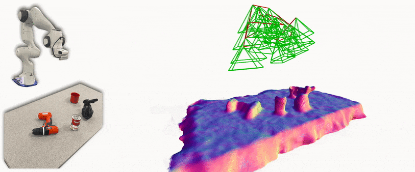

<h1 align="center">
  iSDF
</h1>

<h3 align="center">
  Real-time Neural Signed Distance Fields for Robot Perception
</h3>

<div align="center">
  <a href="https://joeaortiz.github.io/">Joseph Ortiz</a>,
  Alexander Clegg,
  Jing Dong,
  Edgar Sucar,
  David Novotny,
  Michael Zollhoefer,
  <a href="https://www.mustafamukadam.com/">Mustafa Mukadam</a>
  <br/>
  <b>Robotics: Science and Systems (RSS), 2022</b>
</div>

<p></p>

<h4 align="center">
  <a href="https://joeaortiz.github.io/iSDF/"><b>Project page</b></a> |
  <a href="https://arxiv.org/abs/2204.02296"><b>Paper</b></a>
</h4>

iSDF is real-time system the reconstructs the signed distance field (SDF) of room scale environments through the online training of a neural SDF. The model is represented by a MLP that is trained in a continual learning style from a live stream of posed depth images using our self-supervised loss. For details see our [paper](https://arxiv.org/abs/2204.02296).

<div align="center">
  
</div>


### Example results

ReplicaCAD             |  ScanNet
:-------------------------:|:-------------------------:
  |  


## Three iSDF Modes 

There are three options for running iSDF, chose the desired mode and then follow **only** instructions in that section:

1. **[Running iSDF on sequences with pose provided](#1-running-isdf-on-sequences-with-pose-provided)**: for running iSDF on ScanNet and ReplicaCAD sequences used in the paper. 
2. **[Running iSDF with a live camera in ROS](#2-running-isdf-with-a-live-camera-in-ros)**: a ros wrapper for iSDF subscribes to a topic of posed frames that is published by an ORB-SLAM3 wrapper.
3. **[Running iSDF with a Franka and live camera in ROS](#3-running-isdf-with-a-franka-and-live-camera-in-ros)**: a ros wrapper for iSDF subscribes to a topic of realsense frames and poses from a calibrated realsense on a Franka Panda robot.

--- 

## 1. Running iSDF on sequences with pose provided

### Installation
**Please read the [iSDF modes section](#two-isdf-modes) to make sure this is the mode you want before installing!**
```
git clone https://github.com/facebookresearch/iSDF.git && cd iSDF
```

Setup the environment.

```
conda env create -f environment.yml
conda activate isdf
```
Install pytorch by following instructions [here](https://pytorch.org/get-started/locally/), then:
```
pip install -e .
```

### Downloading the data

Make sure to be in the conda environment.
To download a single replicaCAD sequence (5GB):
```
bash data/download_apt_2_nav.sh
```
To download all 12 sequences (15GB):
```
bash data/download_data.sh
```

The data is shared under the same [license](https://creativecommons.org/licenses/by/4.0/) as the Replica-CAD datset. 
For instructions on how to generate the dataset see the [data README](data).

#### ScanNet sequences

To run the ScanNet sequences, you must download the [ScanNet dataset](http://www.scan-net.org/). After downloading the scans, you should export the depth, color, poses and intrinsics for the sequences you wish to use with [this script](https://github.com/ScanNet/ScanNet/tree/master/SensReader/python).  

### Usage

If using ScanNet data, then you must set the directory for the downloaded sequence via the key `scannet_dir` in the config file.

```
cd isdf/train/
python train_vis.py --config configs/replicaCAD.json
```

### Reproducing experiments

Run a batch of iSDF experiments sequentially in headless mode. To run these experiments you must have downloaded all 12 sequences using our bash script as well as separately downloading and exporting the ScanNet sequences. To run only the ReplicaCAD sequences, you can modify the `load_params` function in `batch_utils.py`. If you have multiple GPUs you may want to parallelise the experiment runs. Make sure to update `project_dir` and `scannet_dir` in `jobs_local.py` before running:

```
cd isdf/train
python batch_train/jobs_local.py
```

We have provided results for the baselines that we use in the paper for those wanted to reproduce results for iSDF only. 
Code to reproduce results for our baselines is coming soon. 
<!-- Please see the [Voxblox readme](voxblox) and the [KinectFusion+ readme](kinectfusion+).  -->

Below we provide instructions to generate quantitative and qualitative results as in the paper. Note results may vary depending on the CPU / GPU used.

#### SDF accuracy plots

We provide the script to generate plots comparing SDF error, collision cost error and gradient cosine distance for iSDF and the two baselines. This script was used to generate all quantitative plots in the paper (e.g. Fig 8). Change the variable `isdf_dir` in the script before running:

```
python isdf/eval/figs/all_seq.py
```

--- 

## 2. Running iSDF with a live camera in ROS

We use ROS to interface iSDF with a tracking system and enable running with a live camera. 
The iSDF node subscribes to the topic: `frames`, which is a [custom message type](https://github.com/joeaortiz/ORB_SLAM3_ros/blob/main/msg/frame.msg) containing a time synchronised rgb image, depth image and pose. 
We use a [ROS wrapper for ORB-SLAM3](https://github.com/joeaortiz/ORB_SLAM3_ros) in RGBD mode to publish to this topic.
We have developed this project on Ubuntu 20.04 (and ROS Noetic, so several code changes may be needed to adapt to other OS and ROS versions.

### Installation

##### Clone and build ORB-SLAM3
You may need to install some dependencies first, see [full instructions](https://github.com/UZ-SLAMLab/ORB_SLAM3) if you run into issues.
```
git clone https://github.com/UZ-SLAMLab/ORB_SLAM3.git ORB_SLAM3
cd ORB_SLAM3
chmod +x build.sh
./build.sh
```

##### ROS Noetic
Follow [install instructions](http://wiki.ros.org/noetic/Installation).
Also install catkin tools if not already installed: `sudo apt-get install python3-catkin-tools`.

##### Realsense camera
```
sudo apt-get install ros-$ROS_DISTRO-realsense2-camera
```

##### iSDF and ORB-SLAM3 wrapper

Create a catkin workspace and clone iSDF inside:
```
mkdir -p ~/catkin_ws/src
cd ~/catkin_ws
catkin init
cd src
git clone --recurse-submodules https://github.com/facebookresearch/iSDF.git
```
Open `CMakeLists.txt` and change the directory that points to ORB-SLAM3 library at the beginning of the file (default is home folder).
```
nano ~/catkin_ws/src/iSDF/ORB_SLAM3_ros/CMakeLists.txt

# Change this to your installation of ORB-SLAM3. Default is ~/
set(ORB_SLAM3_DIR
   $ENV{HOME}/ORB_SLAM3
)
```
Unzip the `ORBvoc.txt` file: 
```
cd ~/catkin_ws/src/iSDF/ORB_SLAM3_ros/config
tar -xf ORBvoc.txt.tar.gz
```
Build the ROS packages (while not in a conda environment):
```
cd ~/catkin_ws
catkin_make
source devel/setup.bash
```

Setup the iSDF conda environment.

```
conda env create -f environment.yml
conda activate isdf
```
Install pytorch by following instructions [here](https://pytorch.org/get-started/locally/), then:
```
pip install -e .
```

#### Usage

Before running you need to modify the camera intrinsics for both iSDF and ORB-SLAM3. If you launch the camera (`roslaunch realsense2_camera rs_camera.launch`), the intrinsics are published at `/camera/color/camera_info`. Copy these intrinsics into the iSDF config (`isdf/train/configs/realsense.json`) and the ORBSLAM3 config (`ORB_SLAM3_ros/config/realsense_config.yaml`).

To launch run: 
```
roslaunch isdf train.launch show_orbslam_vis:=true
```
It can be helpful to show the ORB-SLAM3 vis as if the tracking fails iSDF will also fail.

During live operation:

- Press `c` to clear the keyframe set.
- Press `s` to pause live operation and open a 3D visualization window. You can change the 3D visualization using key presses, instructions are printed in the terminal when the window is opened. 

Our ORB-SLAM3 wrapper also contains a launchfile to run with the Azure Kinect camera. To run with a Kinect camera, modify the [`train.launch`](isdf/launch/train.launch) to launch `run_kinect.launch` and install the [kinect ros drivers](https://github.com/microsoft/Azure_Kinect_ROS_Driver).

Current limitations:

- iSDF runs in a single thread and alternates between training (optimising the map) and updating the live visualisation. You can change the frequency of the live visualisation updates, however if set too high, training can become slow.
- The live visualistaion of the rendered depth and normals from the current view uses a very basic depth rendering method. This can lead to artifacts in the render even if the geometry is good. We plan to improve the depth rendering soon.

--- 

## 3. Running iSDF with a Franka and live camera in ROS

<div align="center">
  
</div>

This runs similar to the live camera demo, but subscribes to Franka Panda inverse kinematics rather than ORB-SLAM. Additionally, this implementation has been tuned to work for tabletop scenes and is restricted to a defined workspace. Follow all instructions from the [previous section](#2-running-isdf-with-a-live-camera-in-ros), but the ORB-SLAM steps are not needed. The system requires the following: 
- Extrinsic calibration of the realsense w.r.t. the robot base : use the [eyehandcal](https://github.com/facebookresearch/fairo/tree/main/perception/sandbox/eyehandcal) repository. 
  - Run the automatic script using the `--proj-fun world_marker_proj_hand_camera`. 
  - Copy the contexts of `calibration.json` and add it to `"ext_calib"` in `isdf/train/configs/realsense_franka.json`
- Live ROS topics for rgb, depth, and EE poses of the Franka.
  -  With our modified [franka control](https://github.com/suddhu/franka_control) you can record kinesthetic demonstratations. Please refer to the repository for dependencies and setup. 
  -  When you replay them with `playback.py` they publish the live posed frames. 

## Live script 
After recording the kinesthetic demo with `franka_control`, run the repository's playback script:
```
python playback.py xx/yy.npz
```
To launch run: 
```
roslaunch isdf train_franka.launch
```

## [Tabletop dataset](https://drive.google.com/file/d/1tncMjkFLNlCZztTHwhO6Hn6EoEevGBDL/view?usp=sharing) script
Even without access to a Franka, you can run franka iSDF on our tabletop dataset. The datset consists of 5 datalogs with tabletop [YCB](https://www.ycbbenchmarks.com/object-set/) objects and a 3D printed [Stanford bunny](http://graphics.stanford.edu/data/3Dscanrep/)). 
To download the franka_realsense tabletop dataset (3.4GB):
```
bash data/download_franka.sh
```
To launch run (select the `"seq_dir"` in `realsense_franka_offline.json`): 
```
roslaunch isdf train_franka.launch live:=false inc:=true
```
Franka integration was carried out by [Sudharshan Suresh](https://www.cs.cmu.edu/~sudhars1/), feel free to reach out with questions/comments. 
## Citation

```
@inproceedings{Ortiz:etal:iSDF2022,
  title={iSDF: Real-Time Neural Signed Distance Fields for Robot Perception},
  author={Ortiz, Joseph and Clegg, Alexander and Dong, Jing and Sucar, Edgar and Novotny, David and Zollhoefer, Michael and Mukadam, Mustafa},
  booktitle={Robotics: Science and Systems},
  year={2022}
}
```

## License

iSDF is released under the MIT license. Please see the [LICENSE](LICENSE) file for more information.

## Contributing

We actively welcome your pull requests! Please see [CONTRIBUTING.md](.github/CONTRIBUTING.md) and [CODE_OF_CONDUCT.md](.github/CODE_OF_CONDUCT.md) for more info.
